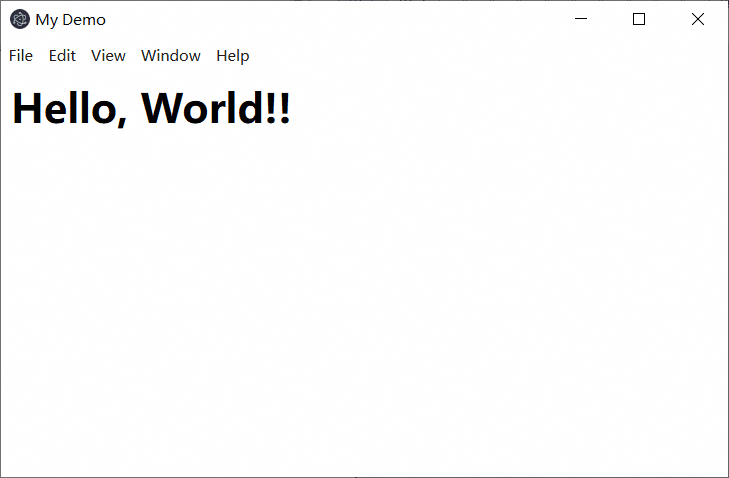
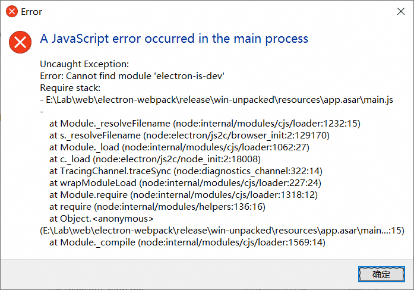
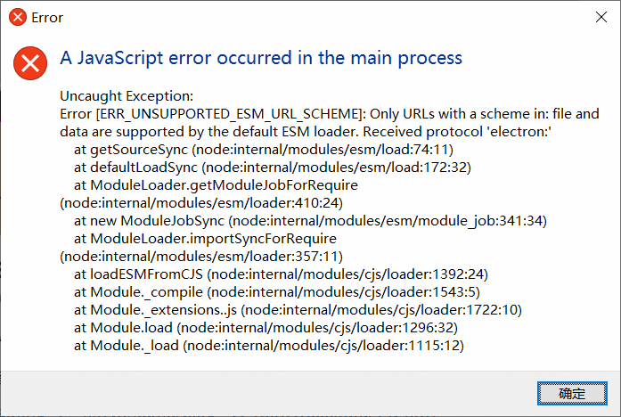
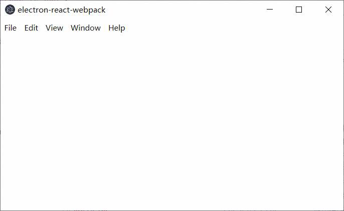
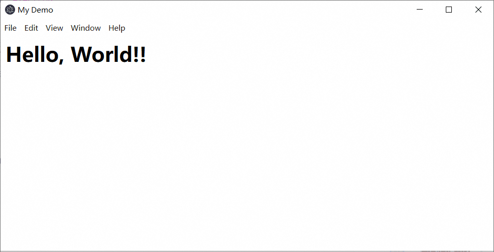

# Electron

前两步没问题，能正确开始 electron 开发调试，但是打包时出错了。

## 安装基础

先初始化成一个普通的 react 项目，新建项目目录，然后进入后：

新建一个空目录，然后进去初始化项目：

```bash
npm init -y
npm install react react-dom
npm install -D webpack webpack-dev-server webpack-cli
npm install -D babel-loader @babel/preset-env @babel/preset-react html-webpack-plugin
```

在项目根目录新建 `.babelrc` 文件：

```json
{
  "presets": ["@babel/preset-env", "@babel/preset-react"]
}
```

以及 `webpack.config.js` 文件：

```js
const path = require('path');
const HtmlWebpackPlugin = require('html-webpack-plugin');
module.exports = (env, argv) => {
  const isProduction = argv.mode === 'production';
  return {
    entry: './src/index.js',
    output: {
      path: path.join(__dirname, 'dist'),
      filename: 'bundle.js',
      publicPath: isProduction ? './' : '/'
    },
    module: {
      rules: [
        {
          test: /\.(js|jsx)$/,
          use: 'babel-loader',
          exclude: /node_modules/
        }
      ]
    },
    plugins: [
      new HtmlWebpackPlugin({
        template: './public/index.html'
      })
    ],
    devServer: {
      port: 3000
    }
  };
}
```

在项目根目录新建 `public` 和 `src` 两个目录，并编辑 `public/index.html` 文件：

```html
<html>
    <head>
    <title>My Demo</title>
    </head>
    <body>
        <div id="root">
        </div>
    </body>
</html>
```

在 `package.json` 中添加命令：

```json
"scripts": {
  "start": "webpack-dev-server --mode development",
  "build": "webpack --mode production"
}
```

创建 `src/index.js` 内容如下：

```js
import React from 'react';
import ReactDOM from 'react-dom/client';
import App from './App';

const root = ReactDOM.createRoot(document.getElementById('root'));
root.render(
  <React.StrictMode>
    <App />
  </React.StrictMode>
);
```

再创建 `src/App.js` 内容如下：

```js
import React from 'react';

export default function App() {
  return <h1>Hello, World!</h1>;
}
```

项目开启：

```bash
npm start
```

即可测试 react 项目的正确性。

## Electron

在前面 react 项目的基础上，进入项目根目录：

```bash
npm install -D electron electron-is-dev concurrently wait-on
```

项目根目录创建 `main.js` 内容如下：

```js
const { app, BrowserWindow } = require('electron');
const path = require('path');
const isDev = require('electron-is-dev');

function createWindow() {
  const win = new BrowserWindow({
    width: 800,
    height: 600,
    webPreferences: {
      nodeIntegration: true,
      contextIsolation: false,
    },
  });

  if (isDev) {
    win.loadURL('http://localhost:3000'); // 开发模式加载 Webpack Dev Server
  } else {
    win.loadFile(path.join(__dirname, 'dist', 'index.html')); // 生产模式加载构建后的文件
  }
}

app.whenReady().then(createWindow);

app.on('window-all-closed', () => {
  if (process.platform !== 'darwin') {
    app.quit();
  }
});

app.on('activate', () => {
  if (BrowserWindow.getAllWindows().length === 0) {
    createWindow();
  }
});
```

修改 `package.json` 的 "scripts" 部分，添加：

```json
"scripts": {
  "start": "webpack-dev-server --mode development",
  "build": "webpack --mode production",
  "electron": "electron .",
  "electron:dev": "concurrently \"npm start\" \"wait-on http://localhost:3000 && electron .\""
}
```

然后修改 "main" 字段为：

```json
"main": "main.js",
```

继续打开 `webpack.config.js` 文件，在 "entry" 字段下面添加内容：

```js
  target: 'electron-renderer',
```

然后用：

```bash
npm run electron:dev
```

开始调试。

可以看到正常弹出 electron 窗口并显示内容：



到目前为止各个功能都符合预期。

## 程序打包（碰到问题）

项目根目录：

```bash
npm install -D electron-builder
```

修改 `package.json`，在 `scripts` 下添加：

```json
    "electron:build": "npm run build && electron-builder"
```

并在 `package.json` 配置对象的顶层添加 `build` 信息：

```json
  "build": {
    "appId": "com.yourcompany.yourappname",
    "productName": "electron-webpack",
    "files": [
      "main.js",
      "dist/**/*",
      "electron/**/*"
    ],
    "directories": {
      "buildResources": "assets",
      "output": "release"
    },
    "mac": {
      "category": "public.app-category.utilities"
    },
    "win": {
      "target": [ "nsis" ]
    },
    "linux": {
      "target": [ "deb", "rpm", "AppImage" ],
      "category": "Utility"
    }
  }
```

然后启动构建：

```bash
npm run electron:build
```

然后在 `release/win-unpacked` 目录下运行 `electron-webpack.exe`，出现错误：



询问 AI 得知 `electron-is-dev` 之前被安装到了开发依赖上了，将其从 `package.json` 的 `devDependencies` 挪动到 `dependencies` 下面，然后删除 `node_modules` 目录和 `package-lock.json`：

```bash
rd /s /q node_modules
del package-lock.json
```

后再：

```bash
npm install
```

成功后再运行一次：

```bash
npm run electron:build
```

这回错误变成：



问了 AI，把 `main.js` 里的：

```js
const { app, BrowserWindow } = require('electron');
const path = require('path');
const isDev = require('electron-is-dev');
```

换成：

```js
import { app, BrowserWindow } from 'electron';
import path from 'path';
import isDev from 'electron-is-dev';
```

然后再打包，重新运行 `release/win-unpacked` 下面新生成的 `electron-webpack.exe` 文件，没错误了，但是是个白窗口，我的内容完全没有载入：



没有任何内容，而我之前不打包时用：

```bash
npm run electron:dev
```

却能正常显示内容。

更新：经过高人提醒，代码 `main.js` 里面的 `__dirname` 不存在，八成是我之前看了什么过时教程导致的，将原有的：

```js
win.loadFile(path.join(__dirname, 'dist', 'index.html'));
```

改成：

```js
win.loadFile(path.join(app.getAppPath(), 'dist', 'index.html'));
```

后问题解决：



谢谢大家！！
